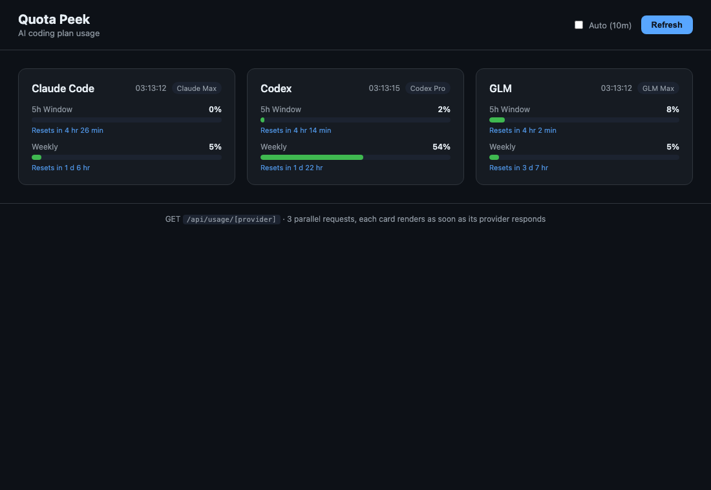

# ⚡ Quota Peek

> One dashboard for your AI coding-plan usage — **Claude Code**, **Codex**, and **GLM** in a single glance.



[](https://opensource.org/licenses/MIT)
[](https://nextjs.org/)
[](https://www.typescriptlang.org/)
[](https://nodejs.org/)

Quota Peek aggregates live usage/quota from the three big AI coding plans into one clean, dark dashboard. No cron. No database. No background jobs. Providers are queried live on every request.

## ✨ Features

- **Three providers, one view** — Claude Code, Codex (ChatGPT), and GLM Coding Plan, side by side.
- **Independent cards** — the dashboard fires 3 parallel requests; each card renders the instant its provider responds. The slowest never blocks the rest.
- **Normalized metrics** — every provider shows the same two windows: **5h Window** and **Weekly**, with precise countdowns like `Resets in 4 hr 36 min` or `Resets in 1 d 6 hr`.
- **Smart refresh** — manual refresh, optional auto-refresh (10 min), and automatic refresh when you refocus the tab after 3+ minutes.
- **Resilient** — a provider that isn't configured or errors out degrades to an offline card; it never breaks the others. Claude's results are cached briefly and served stale on failure.
- **Zero infrastructure** — a single Next.js app. Run it, open it, done.

## 🚀 Quick start

```bash
git clone https://github.com/cokekitten/quota-peek.git
cd quota-peek
npm install
cp .env.example .env   # fill in GLM_API_KEY (the only required secret)
npm run dev            # → http://localhost:5928
```

For production:

```bash
npm run build && npm start
```

Requires Node ≥ 18.18. The app runs on **port 5928** by default (pinned in `package.json`).

## 🔧 Provider configuration

| Provider | How it authenticates | What you need |
| --- | --- | --- |
| **Claude Code** | OAuth token from `~/.claude/.credentials.json` → Anthropic's `/api/oauth/usage` | Just be logged in via the `claude` CLI with a subscription. Nothing to configure. |
| **Codex** | Reads `~/.codex/auth.json`, calls the internal `wham/usage` endpoint | Run Codex once so the auth file exists. Nothing to configure. |
| **GLM** | API key in the `Authorization` header | Set `GLM_API_KEY` in `.env` (**required**). Use `GLM_BASE_URL` for z.ai international. |

A provider that isn't set up returns `ok: false` with a helpful `error` message — it shows an offline card and never breaks the others.

### Environment variables

See [`.env.example`](.env.example) for the full list. The only one you must set is `GLM_API_KEY`. Everything else has sensible defaults.

## 🏗️ How it works

```
GET /api/usage/[provider]   ← single dynamic route: claude | codex | glm
GET /                        ← the dashboard (static)
```

Each provider is a tiny server-only module in `lib/providers/`. They normalize their wildly different upstream responses into one shape:

```jsonc
{
  "label": "5h Window",          // "5h Window" | "Weekly"
  "kind": "5h",                  // "5h" | "weekly"
  "percent": 4,                  // 0–100
  "resetAt": "2026-06-13T23:39:59.867Z"
}
```

The dashboard client fires **3 parallel fetches** (one per provider) and each `ProviderCard` owns its own `loading → data | error` state — so they render independently as data arrives.

### Project structure

```
app/
  api/usage/[provider]/route.ts   # single dynamic route handler (nodejs runtime)
  globals.css                     # dark dashboard styles
  icon.svg                        # favicon
  layout.tsx · page.tsx           # root layout + server shell → <Dashboard />
components/
  Dashboard.tsx                   # 'use client' — parallel fetches, refresh logic, refocus
  ProviderCard.tsx                # 'use client' — per-card state, bars, countdowns
  types.ts                        # client-side response types
lib/providers/
  claude.ts · codex.ts · glm.ts   # server-only providers
  index.ts                        # registry + fetchOneUsage()
  types.ts                        # shared domain types
```

## ⚠️ Notes & caveats

- **Codex** relies on an internal ChatGPT endpoint (`backend-api/wham/usage`). It's undocumented and may change without notice.
- **Claude** uses Anthropic's OAuth usage API (`/api/oauth/usage`). It rate-limits aggressively, so results are cached for 60 s and served stale for up to 5 min on failure. If the OAuth token expires, run `claude` interactively to refresh it.
- **GLM** window labels are derived from each limit's actual `nextResetTime`, so they stay correct even as the opaque `unit` codes shift.
- The **GLM** key in your `.env` is read at request time — restart the server after changing it.

## 🤝 Contributing

Contributions are welcome! This is a small, focused project. If you'd like to add a provider or fix a bug:

1. Fork the repo and create a branch.
2. Add a provider module under `lib/providers/` that returns the normalized `ProviderResult` shape.
3. Register it in `lib/providers/index.ts`.
4. Open a PR.

## 📄 License

[MIT](LICENSE) — do whatever you want.
