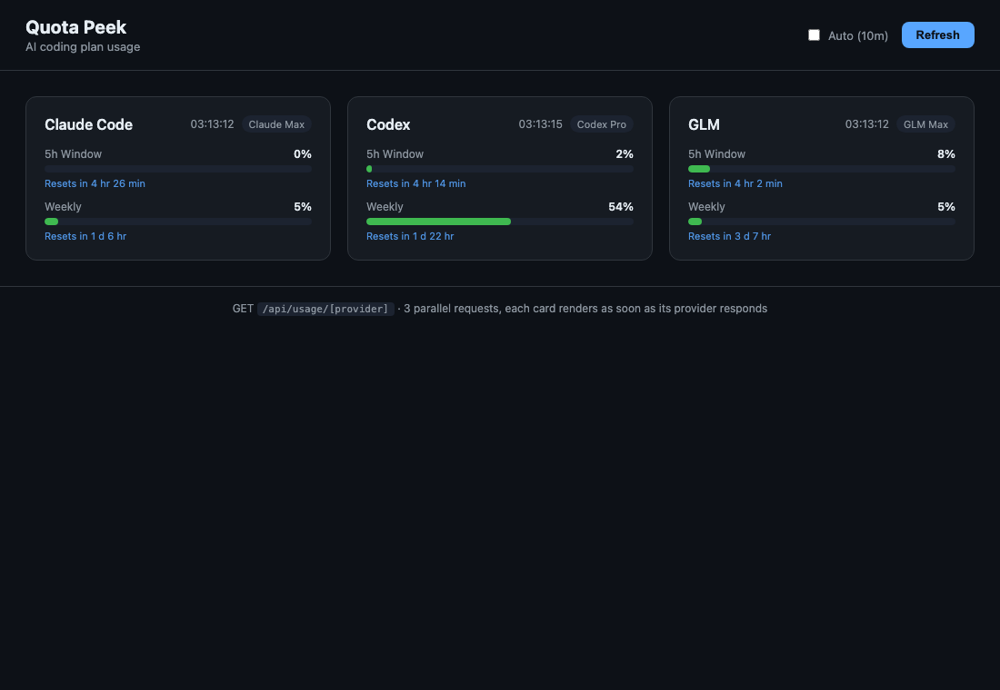

# ⚡ Quota Peek

> One dashboard for your AI coding-plan usage — **Claude Code**, **Codex**, **GLM**, **SuperGrok**, **MiniMax** (国内 Token Plan), **Kimi** (Kimi Code 会员), **Volcengine**, **StepFun** (阶跃星辰 Step Plan), **DeepSeek**, **Xiaomi MiMo** (小米 Token Plan) and **OpenRouter** in a single glance.



[](https://opensource.org/licenses/MIT)
[](https://nextjs.org/)
[](https://www.typescriptlang.org/)
[](https://nodejs.org/)

Quota Peek aggregates live usage/quota from major AI coding/subscription plans into one clean, dark dashboard. A small background sampler reads every provider on a fixed interval and records each reading to a local SQLite file, so the cards answer from the sampler's last reading (no second round of upstream calls) and [/history](#-usage-history) can show what any poll or refresh actually saw. **Refresh** runs one sampling round now.

## ✨ Features

- **Eleven providers, one view** — Claude Code, Codex (ChatGPT), GLM Coding Plan, SuperGrok (xAI), MiniMax Token Plan (国内), Kimi (Kimi Code 会员), Volcengine (火山方舟 Coding Plan), StepFun (阶跃星辰 Step Plan), DeepSeek (充值余额 + 当月消费), Xiaomi MiMo (小米 Token Plan) and OpenRouter (钱包余额 + 当月消费), side by side.
- **Independent cards** — the dashboard fires one parallel request per provider; each card renders the instant its provider responds. The slowest never blocks the rest.
- **Normalized metrics** — providers show their real windows (**5h Window** and/or **Weekly**, depending on what the plan actually has), with precise countdowns like `Resets in 4 hr 36 min` or `Resets in 1 d 6 hr`.
- **Smart refresh** — manual refresh, optional auto-refresh (10 min), and automatic refresh when you refocus the tab after 3+ minutes.
- **Usage history** — a background sampler (5 min, no cron) records every provider reading to a local SQLite file: percentage, absolute figures, each account separately, and failures. Cards stay a glanceable snapshot with a change badge (`+2.5%`, `-¥0.31`, `↻ reset` when a window rolled over) that is grey below 2 percentage points, amber to 10, red beyond — a routine poll tick must not look like an alarm, and the pace badge keeps red/amber/green for its own question — a trend line under every bar reads as a stray rule, so the curves live on `/history`: any window over 24 h / 7 d / 30 d, next to a log of what each read saw. CSV export included.
- **No double fetching** — the page reads the sampler's last reading instead of calling every provider again, so opening the dashboard can't be the reason a rate-limited card goes offline. A reading younger than one interval is served as-is, one to two intervals old is served with a `cached` tag, and beyond that the app goes upstream for real. A served reading is not written to history twice; the sampler already recorded it.
- **Resilient** — a provider that errors out degrades to an offline card; it never breaks the others. Claude's results are cached briefly and served stale on failure.
- **No dead cards** — a provider with no key / no credential file is hidden instead of occupying a slot; the `No key ×N` pill in the header reveals them (each one names the variable to set) and the choice is remembered in `localStorage`. A provider that **is** configured but failing — expired token, 429, network down — never hides, because that's the signal you opened the dashboard for.
- **Zero infrastructure** — a single Next.js app plus one SQLite file. Run it, open it, done; history is just a file you can delete or back up.

## 🚀 Quick start

```bash
git clone https://github.com/cokekitten/quota-peek.git
cd quota-peek
npm install
cp .env.example .env   # fill in GLM_API_KEY (required for GLM); SuperGrok uses ~/.grok/auth.json; MiniMax uses MINIMAX_API_KEY (Token Plan Subscription Key); Kimi uses ~/.kimi-code/credentials/kimi-code.json
npm run dev            # → http://localhost:5928
```

For production:

```bash
npm run build && npm start
```

Requires Node ≥ 18.18. The app runs on **port 5928** by default (pinned in `package.json`).

### 🐳 Run with Docker

Prefer containers? The repo ships a multi-stage `Dockerfile` that builds the
Next.js **standalone** bundle into a slim image (~200 MB). No Node on your host
needed.

```bash
git clone https://github.com/cokekitten/quota-peek.git
cd quota-peek
docker build -t quota-peek .
```

Then run it, mounting your local credential files read-only and passing the
GLM key as an env var:

```bash
docker run -d --name quota-peek -p 5928:5928 \
  -e GLM_API_KEY="your-glm-key" \
  -e CLAUDE_CREDENTIALS_PATH="/secrets/claude-creds.json" \
  -e CODEX_AUTH_PATH="/secrets/codex-auth.json" \
  -e GROK_AUTH_PATH="/secrets/grok/auth.json" \
  -e MINIMAX_API_KEY="your-minimax-subscription-key" \
  -e KIMI_API_KEY="your-kimi-code-api-key" \
  -e DEEPSEEK_API_KEY="sk-..." \
  -e DEEPSEEK_TOKEN="web-console-userToken-optional" \
  -e MIMO_USER_ID="your-xiaomi-userId" \
  -e MIMO_PASS_TOKEN="your-xiaomi-passToken" \
  -v "$HOME/.claude/.credentials.json:/secrets/claude-creds.json:ro" \
  -v "$HOME/.codex/auth.json:/secrets/codex-auth.json:ro" \
  -v "$HOME/.grok:/secrets/grok" \
  -v "$PWD/data:/app/data" \
  quota-peek
```

Add `-v "$PWD/data:/app/data"` to keep the usage history across container
recreates. Create it first — the container runs as uid 1000, so on macOS
bind mounts it must be world-writable (`mkdir -p data && chmod 777 data`; on
Linux use `chown 1000:1000 data`). Add `-e QP_POLL=0` to turn the background sampler
off.

→ open **http://localhost:5928**

**How the secrets work in Docker:**

- **GLM** — a plain API key, passed via `-e GLM_API_KEY`.
- **Claude Code** & **Codex** — these read credential *files* (`~/.claude/.credentials.json`, `~/.codex/auth.json`) that only exist where you logged in. The image never bakes them in. Instead, bind-mount each file from your host into the container (read-only with `:ro`) and point the app at the mount path via `CLAUDE_CREDENTIALS_PATH` / `CODEX_AUTH_PATH`. Omit a mount and that provider simply shows as offline — the others keep working.
- **SuperGrok** — reads `~/.grok/auth.json` (created by the official `grok` CLI after `grok login`). Mount the **directory** `~/.grok` read-write (not the file as `:ro`). xAI refresh tokens rotate; a read-only file mount lets the dashboard burn the login and then fail. If absent the card shows offline gracefully.
- **MiniMax** (国内) — plain Subscription Key passed via `-e MINIMAX_API_KEY=...`. No file mount needed.
- **Kimi** — pass `-e KIMI_API_KEY=...` (an API Key from the Kimi Code Console), or mount `~/.kimi-code/credentials/kimi-code.json` the same way as the other credential files via `KIMI_CREDENTIALS_PATH`. Prefer the API key in Docker: OAuth access tokens last ~15 min and refresh write-back needs a writable file.
- **DeepSeek** — plain env vars: `-e DEEPSEEK_API_KEY=sk-...` for the balance row, optionally `-e DEEPSEEK_TOKEN=...` (web-console `userToken`) for the 消费金额/充值余额 row.
- **MiMo** — recommended: `-e MIMO_USER_ID=… -e MIMO_PASS_TOKEN=…` (account.xiaomi.com cookies) for automatic renewal; the renewed session is cached in `MIMO_SESSION_FILE` (compose mounts `./mimo-session` writable). Or pass `-e MIMO_COOKIE='…'` with the console Cookie header (~1 day, manual re-paste).

<details>
<summary>Or with Docker Compose (recommended)</summary>

The repo includes a [`docker-compose.yml`](docker-compose.yml) that does all of the
above. It reads `GLM_API_KEY` from your environment (or a `.env` file next to the
compose file), and defaults the credential mounts to the usual paths — override
them if yours differ.

```bash
export GLM_API_KEY="your-glm-key"
docker compose up -d --build   # → http://localhost:5928
docker compose logs -f         # follow logs
docker compose down            # stop & remove
```

SuperGrok will be picked up automatically if `~/.grok/auth.json` exists on the host (mounted by default in compose).

Override the credential paths (e.g. non-default locations):

```bash
CLAUDE_CREDENTIALS=/path/to/creds.json \
CODEX_AUTH=/path/to/auth.json \
GROK_DIR=/path/to/.grok \
MINIMAX_API_KEY=your-key \
KIMI_API_KEY=your-kimi-code-api-key \
docker compose up -d --build
```

</details>

> **Note:** if your Claude OAuth token expires, refresh it by running `claude`
> on the host (where you're logged in), then restart the container. The mounted
> file updates automatically.

## 🔧 Provider configuration

| Provider | How it authenticates | What you need |
| --- | --- | --- |
| **Claude Code** | OAuth token from `~/.claude/.credentials.json` → Anthropic's `/api/oauth/usage` | Just be logged in via the `claude` CLI with a subscription. Nothing to configure. |
| **Codex** | Reads `~/.codex/auth.json`, calls the internal `wham/usage` endpoint | Run Codex once so the auth file exists. Nothing to configure. |
| **GLM** | API key in the `Authorization` header | Set `GLM_API_KEY` in `.env` (**required**). Use `GLM_BASE_URL` for z.ai international. |
| **SuperGrok** | OAuth token from `~/.grok/auth.json` (via `grok login`) + internal `cli-chat-proxy.grok.com/v1/billing` | Just run the official Grok CLI (`grok login`) once with an active SuperGrok subscription. Nothing else to configure. |
| **MiniMax** (国内) | Subscription Key (Token Plan) via `Authorization: Bearer` to `https://www.minimaxi.com/v1/token_plan/remains` | Set `MINIMAX_API_KEY` to your Token Plan Subscription Key from minimaxi.com. Defaults to domestic endpoint. |
| **Kimi** | OAuth credentials from `~/.kimi-code/credentials/kimi-code.json` (auto-refreshed) → `api.kimi.com/coding/v1/usages`, or a Console API Key | Just be logged in via the Kimi Code CLI. Or set `KIMI_API_KEY` to an API Key from the Kimi Code Console. |
| **Volcengine** (火山方舟) | AK/SK-signed (HMAC-SHA256 V4) `GetCodingPlanUsage` on the Ark control plane (falls back to `GetAFPUsage` for older Agent Plans) | Set `VOLC_ACCESS_KEY` / `VOLC_SECRET_KEY` from 火山引擎控制台 → 密钥管理. Session(5h)/weekly/monthly windows (5h + weekly shown). |
| **StepFun** (阶跃星辰) | Session-authenticated `QueryStepPlanRateLimit` + `GetStepPlanStatus` on platform.stepfun.com (`oasis-appid/platform/webid` headers) | Paste the `cookie` header of a logged-in platform.stepfun.com into `STEPFUN_COOKIE` (or just the Oasis-Token into `STEPFUN_TOKEN`). The `sk-` API key does **not** work — it only sees your top-up balance. |
| **DeepSeek** | Official `GET api.deepseek.com/user/balance` with the `sk-` API key; month spend via the platform's internal `usage/by_api_key/cost` with the web-console `userToken` | Set `DEEPSEEK_API_KEY` (balance). Optionally set `DEEPSEEK_TOKEN` to the `userToken` from `localStorage` on platform.deepseek.com to add the **Spend / Balance** row — it degrades to balance-only when the token expires. |
| **MiMo** (小米) | Console-cookie-authenticated `GET platform.xiaomimimo.com/api/v1/tokenPlan/usage` + `/api/v1/tokenPlan/detail` (reset time) + `/api/v1/usage` (当月消费) + `/api/v1/balance` (the `tp-` API key can spend quota but cannot query it). The ~24h console cookie renews itself via the Xiaomi Account SSO seed (`userId`+`passToken`) when provided | Recommended: set `MIMO_USER_ID` + `MIMO_PASS_TOKEN` (account.xiaomi.com cookies — long-lived, auto-renews the session). Fallback: `MIMO_COOKIE` with a pasted console Cookie header (~1 day). |
| **OpenRouter** | Management key → `GET /api/v1/credits` (wallet: `total_credits − total_usage`) + `POST /api/v1/analytics/query` (account-wide month spend); regular key → `GET /api/v1/key` (fallback: that key's own month) | Set `OPENROUTER_MANAGEMENT_KEY` (/settings/management-keys — admin key that cannot call models; give it an expiry). The regular `OPENROUTER_API_KEY` is optional, a per-key fallback source only. |

A provider that isn't set up returns `ok: false` with `notConfigured: true` and a hint naming the variable to set — its card stays hidden until you turn on the `No key ×N` toggle, and never breaks the others.

**MiniMax** uses the domestic Token Plan endpoint by default and reports the same 5h rolling + weekly windows as the other providers.

### Environment variables

See [`.env.example`](.env.example) for the full list. The only one you must set is `GLM_API_KEY`. Everything else has sensible defaults.

**SuperGrok** requires no extra env var if you use the default `~/.grok/auth.json`. Set `GROK_AUTH_PATH` to point at a non-standard location (especially useful under Docker).

**MiniMax** (国内) requires `MINIMAX_API_KEY` (your Token Plan Subscription Key). Use `MINIMAX_BASE_URL` to switch to global endpoint if needed.

**Kimi** omits the `used` field entirely on a window where nothing has been consumed (`{limit, remaining}`), so usage is read as `limit − remaining` — a fresh account is a real 0% row, not a missing one. A 200 with no usable window is reported as a failure rather than an empty card, so a shape change shows up instead of silently dropping the account from the merge. Works out of the box if you're logged in via the Kimi Code CLI (it reads `~/.kimi-code/credentials/kimi-code.json` and refreshes expired tokens, writing the rotated pair back). Alternatively set `KIMI_API_KEY` to an API Key from the Kimi Code Console — recommended for Docker.

**StepFun** needs a *session*, not an API key: `QueryStepPlanRateLimit` answers only to the web console's cookies. Open `platform.stepfun.com/plan-usage` while logged in, copy the `cookie` request header of any Dashboard API call into `STEPFUN_COOKIE`, or just the `Oasis-Token` value into `STEPFUN_TOKEN`. In the latter case the mandatory `Oasis-Webid` header is decoded from the token's own `device_id` claim (mismatch ⇒ `oasis-token is embezzled`); paste the paired `access...refresh` form and expired access tokens get refreshed automatically. The access token only lives ~30 min, so renewed pairs are cached in `STEPFUN_SESSION_FILE` (0600, keyed by a fingerprint of the credential — multi-account safe) because the spent half still sitting in `.env` cannot be reused forever. Credit-denominated plans (`plan_family: 2`) report one **Monthly** row instead of 5h/weekly windows — the two billing shapes are told apart by the response payload, since `plan_family` alone lies.

**DeepSeek** is a money card, not a window card: one **Spend / Balance** row (消费金额/充值余额) — the current month's spend (当月, the console's month filter; daily buckets summed from its internal usage API) over the top-up balance (充值余额, the console's headline number from the official `user/balance` API with your `sk-` key; granted/赠金 is not re-stated). The row's percent is the spend share of the money pool (`spend / (spend + top-up)`) — bounded 100% by construction: 0% when nothing is spent, 100% once the balance is gone — and the usage API needs the web-console `userToken` (`JSON.parse(localStorage.getItem('userToken')).value` on platform.deepseek.com — not the `sk-` key, which gets a 40003). Without the token the card degrades to a bare **Balance** amount with a note instead of failing it.

**MiMo** (小米) also authenticates with a console session: the Token Plan's `tp-` API key can spend the quota but Xiaomi exposes no API-key route to *query* it. `MIMO_COOKIE` (the full Cookie header; the `api-platform_serviceToken` cookie is the one that matters) unlocks `tokenPlan/usage` → **Compensation** (补偿积分) and **Monthly** rows, plus a **Spend / Balance** money row (当月消费/余额: `usage.costUsage.currentMonthCost` from `/api/v1/usage` over the pay-as-you-go 余额) carrying the same pool-share percent as DeepSeek. Without the spend summary it degrades to a bare **Balance** amount; money rows never re-state the total. **Token Plan** (套餐积分) is the same counter as **Monthly** and only shows as a fallback when the payload carries no `monthUsage`. The **Monthly** window (套餐月总量) is the plan's *billing cycle*, not a calendar month — its reset comes from `tokenPlan/detail`'s `currentPeriodEnd` (the console's "有效期至 … (UTC)" line on plan-manage; a bare timestamp that means UTC), so the countdown says `Resets in 28 d 10 hr` when the period actually rolls. When `detail` is unavailable or the period already lapsed, the row simply shows no countdown rather than guessing one. Console cookies live ~24h with no refresh endpoint — but the browser renews them silently through your Xiaomi Account session, and the provider re-enacts exactly that when you set `MIMO_USER_ID` + `MIMO_PASS_TOKEN` (the long-lived `account.xiaomi.com` cookies; `passToken` is HttpOnly — copy it from DevTools): on a 401 it calls `genLoginUrl`, exchanges the seed at `account.xiaomi.com/pass/serviceLogin?_json=true` (computing Xiaomi's `clientSign = base64(sha1("nonce=…&ssecurity"))`), visits the signed `/sts` callback to re-issue the four platform cookies, verifies against `/api/v1/userProfile` and retries — rotating seeds are cached in `MIMO_SESSION_FILE` (0600) so a restart doesn't spend them again. Treat `passToken` like a password; if it ever leaks, sign the account out to revoke it.

**OpenRouter**'s card is account-wide through the Management key (`/settings/management-keys` — admin-only, cannot call models; give it an expiry): the wallet from `GET /api/v1/credits`, the month from `POST /api/v1/analytics/query` (every key on the account, even unconfigured ones — per-key `usage_monthly` understates as soon as a key is missing). A regular `OPENROUTER_API_KEY` is only a fallback source for per-key numbers when the management key is absent. Key spending caps are deliberately not shown: most keys are uncapped, so any aggregate of the capped few reads like an account limit and misleads.

**Usage history** (all optional, sensible defaults):

| Variable | Default | What it does |
| --- | --- | --- |
| `QP_POLL` | `1` | Background sampler on/off. `0` records only when someone loads the dashboard. |
| `QP_POLL_INTERVAL_MS` | `300000` | Sampling interval (floor: 60 s — the upstreams rate-limit). |
| `QP_DATA_DIR` | `./data` | Where `quota-peek.db` lives. Docker: `/app/data`, mounted as a volume. |
| `QP_HISTORY_DAYS` | `90` | Raw sample retention; older samples are pruned each round. |
| `QP_CACHE_TTL_MS` | `60000` | Reuse window so a poll and a page load don't double-hit a provider. |
| `QP_SELF_URL` | `http://127.0.0.1:$PORT` | Where the boot hook hands off to the poller (set it if the port is mapped). |

### Multiple accounts (key-based providers)

GLM, MiniMax, Kimi, Volcengine, StepFun, DeepSeek, MiMo and OpenRouter support multiple accounts on a single card. Leave the normal vars as account 1 and add `_2`, `_3`, … suffixed vars for the rest — e.g. `KIMI_API_KEY_2`, `GLM_API_KEY_2`, `MINIMAX_API_KEY_2`, `VOLC_ACCESS_KEY_2` + `VOLC_SECRET_KEY_2`, `STEPFUN_COOKIE_2`, `DEEPSEEK_API_KEY_2` + `DEEPSEEK_TOKEN_2`, `MIMO_USER_ID_2` + `MIMO_PASS_TOKEN_2` (or `MIMO_COOKIE_2`), `OPENROUTER_API_KEY_2` (numbering gaps are fine). With 2+ accounts configured the card's bars show the **combined** quota (weighted by absolute used/total when the provider reports it, otherwise a mean marked ≈), and a **Σ / 1 / 2 toggle** in the card header switches between the merged view and each account. A failed account never breaks the others: it's excluded from the merge and shows its error when selected.

## 🏗️ How it works

```
GET /api/usage/[provider]      ← single dynamic route: claude | codex | glm | supergrok | minimax | kimi | volcengine | stepfun | deepseek | mimo | openrouter
POST /api/usage/refresh       ← run one sampling round now (what the Refresh button calls)
GET /api/history               ← short window behind the card change badges (all providers, one request)
GET /api/history/[provider]    ← one channel: chart series + refresh log
GET /api/history/[provider]/export   ← the same rows as CSV
GET /api/poll                  ← poller control: GET starts/reports, POST runs a round now (loopback only)
GET /                           ← the dashboard
GET /history                    ← the history page
```

Each provider is a tiny server-only module in `lib/providers/`. They normalize their wildly different upstream responses into one shape:

```jsonc
{
  "label": "5h Window",          // "5h Window" | "Weekly"
  "kind": "5h",                  // "5h" | "weekly"
  "percent": 4,                  // 0–100
  "resetAt": "2026-06-13T23:39:59.867Z"
}
```

The dashboard client fires **parallel fetches** (one per provider) and each `ProviderCard` owns its own `loading → data | error` state — so they render independently as data arrives.

### Project structure

```
app/
  api/usage/[provider]/route.ts   # single dynamic route handler (nodejs runtime)
  globals.css                     # dark dashboard styles
  icon.svg                        # favicon
  layout.tsx · page.tsx           # root layout + server shell → <Dashboard />
  history/page.tsx                # 'use client' — provider/range switch, charts, refresh log
components/
  Dashboard.tsx                   # 'use client' — parallel fetches, refresh logic, refocus, history data
  ProviderCard.tsx                # 'use client' — per-card state, bars, countdowns, Δ badge
  TrendChart.tsx                  # 'use client' — SVG charts with axes, for /history
lib/spark.ts                     # trend geometry (segments, gaps, reset rules) — pure
  types.ts                        # client-side response types
lib/history/
  db.ts                           # SQLite connection + schema (two tables, additive)
  extract.ts                      # ProviderResult → sample + rows (schema-agnostic)
  store.ts                        # append / range queries / prune / CSV rows
  series.ts                       # bucketing, deltas, rollover + gap detection
  liveCache.ts                    # 60s dedupe (successes only) + the sampler's latest reading
  serve.ts                        # what a page request answers with: cache while fresh, else fetch
  poller.ts                       # the background sampler (one timer, one process)
  *.test.ts                       # the store is tested against a real temporary database
lib/providers/
  claude.ts · codex.ts · glm.ts · supergrok.ts · minimax.ts · kimi.ts · volcengine.ts · stepfun.ts   # server-only providers
  index.ts                        # registry + fetchOneUsage()
  types.ts                        # shared domain types
```

## 📈 Usage history

Every provider read is a sample: the window percentages, the absolute figures
(balance, month spend, credit counts), **each configured account separately**,
and — when a read fails — the failure itself, so a flat line is never confused
with "no data".

- **A background sampler** fetches all configured providers every 5 minutes
  (`QP_POLL_INTERVAL_MS`) whether or not anyone has the dashboard open, plus a
  sample for every page-driven read (`source` is `poll` or `page` in the data).
  It starts itself through `GET /api/poll` at boot and is idempotent — one
  timer per process, and it never starts a second round while one is running.
- **Cards** carry one change badge per row — the difference against the
  previous reading — and nothing else. They stay a snapshot you can read in
  one glance; a trend line under every bar only adds noise there. Money rows
  are compared in their own unit (¥ spent, balance left), because a balance has
  no percentage to speak of.
- **`/history`** charts each window (and each account) over 24 h / 7 d / 30 d,
  with the refresh log underneath: one row per read, source, values, error.
  `Export CSV` gives the raw rows for spreadsheet work.
- **Honest charts.** A window rollover is never reported as a drop: when the
  row's own reset clock moves by more than 5 minutes the delta becomes
  `↻ reset` and the line breaks. Gaps longer than 3 sampling intervals (a
  stopped container, a sleeping laptop) break the line too, instead of drawing
  a slope that never happened.
- **Storage** is a single SQLite file (`sample` + `sample_row`, WAL) — about
  3.2k samples/day across all providers, ~90 days by default, pruned
  automatically. Back it up by copying the file; delete it to start over.

## ⚠️ Notes & caveats

- **Codex** relies on an internal ChatGPT endpoint (`backend-api/wham/usage`). It's undocumented and may change without notice. Codex no longer has a 5h window — windows are classified by their actual duration, so the card shows whatever the plan currently has (weekly only).
- **Claude** uses Anthropic's OAuth usage API (`/api/oauth/usage`). It rate-limits aggressively, so results are cached for 60 s and served stale for up to 5 min on failure. If the OAuth token expires, run `claude` interactively to refresh it.
- **SuperGrok** access tokens expire after ~6h; the app refreshes them via the OIDC refresh_token grant and writes the rotated pair back to `~/.grok/auth.json`. It will **not** refresh if that file is not writable (a successful grant + failed write-back invalidates `grok login`). If refresh fails (revoked token), run `grok login` again.
- **Kimi** access tokens expire after ~15 min and are refreshed the same way. In Docker, prefer `KIMI_API_KEY` since the mounted credentials file is read-only.
- **GLM** window labels are derived from each limit's actual `nextResetTime`, so they stay correct even as the opaque `unit` codes shift.
- The **GLM** key in your `.env` is read at request time — restart the server after changing it.
- **The sampler assumes one server process.** Running multiple replicas would poll and record N times; give each its own `QP_DATA_DIR` or run one replica with polling on.

## 🤝 Contributing

Contributions are welcome! This is a small, focused project. If you'd like to add a provider or fix a bug:

1. Fork the repo and create a branch.
2. Add a provider module under `lib/providers/` that returns the normalized `ProviderResult` shape.
3. Register it in `lib/providers/index.ts`.
4. Open a PR.

## 📄 License

[MIT](LICENSE) — do whatever you want.
